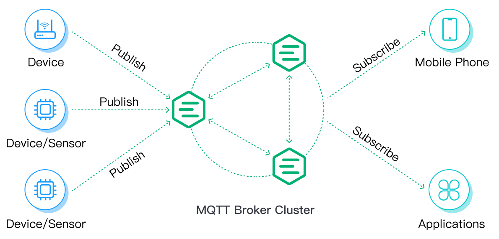
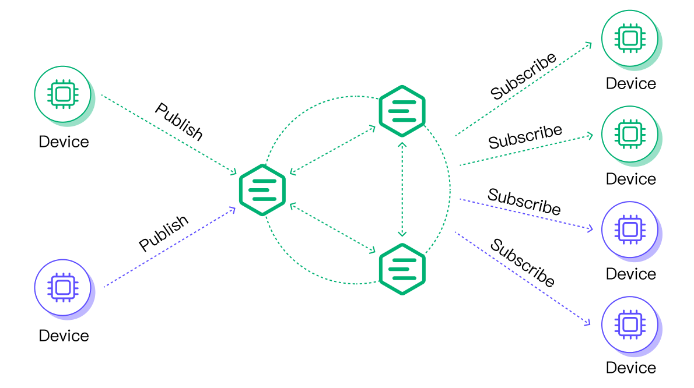
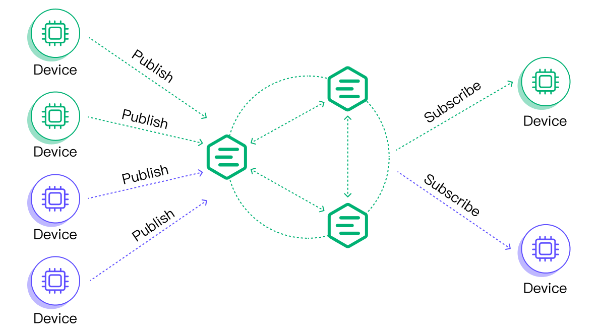

# Open MQTT Benchmark Suite
## Introduction

MQTT is a communication protocol based on Publish/Subscribe model. It has the following features:

- Simple and easy to implement
- QoS support for complex device network environment.
- Lightweight and designed specially for unstable network connections and bandwidth saving
- Data irrelevant
- Continuous session awareness

Those characteristics make it suited for IoT applications, and become one of the most popular protocols in IoT domain.

In a typical MQTT Publish/Subscribe architecture, there are publishers, subscribers, and a broker in the system. A publisher sends a message to the broker on a specific topic and then the broker sends that message to all subscribers which are subscribed to the same topic.

As a broker is the central component in an MQTT based IoT application, it plays an important role in the scalability and availability of the application.  There have been many research papers and technical writeups on the performance evaluation and comparison of various MQTT brokers. However, the existing benchmarks often measure particular factors only, with scenarios not matching the realistic large-scale IoT applications. Through development and customer support experience of the past decade, we have learnt that many factors impact MQTT broker performance.

For one thing, MQTT protocol states many features improving reliability and security, which bring overhead cost on broker side as well. Some of the features are:

- QoS
- Keep Alive
- Clean Session
- Retain
- Topic wildcards
- Authentication method
- TLS authentication enablement

In addition, different MQTT versions suggest different functions. For example, shared subscription is supported in MQTT 5.0 but not 3.1.1 or 3.1.

For another thing, MQTT brokers deployment ways influence the performance evaluation. The brokers can be deployed on single node, or in a cluster way. If it is deployed in a cluster way, it can be put behind a load balancer or not. To be comparable, the brokers should be deployed in the similar ways.

What is more, environment conditions like hardware, OS, system and network configuration also impact the evaluation result. Some of the important conditions are:

- receive buffer size
- network round trip time

The rapid development of IoT applications brings new challenges. As a hub of devices and data, the capability of the MQTT broker to support massive device connectivity and data throughput is critical to the IoT business. Consequently, a thorough evaluation on its performance is important in the full IoT solution. The intent of this work is suggesting metrics and evaluation criteria, presenting real-world scenarios and use cases, and in the future, providing a tool that fully compatible with the benchmark suite. To this end, we hope to establish a practical base for benchmarking MQTT brokers, iteratively optimize its coverage, and help users find the most suitable MQTT broker for their needs and workloads.

## Methodology

To measure performance of an MQTT broker, we need to define metrics,  which can be looked at in a variety of use cases. Two primary  perspectives of measurement are considered. One focuses on the computing resources perspective. The other focuses on the capabilities provided  by the MQTT broker itself, and divides into three detailed aspects -  scalability, availability, and latency, as suggested in Google “Cloud  Pub/Sub” product guide. It should be noticed that different aspects may  contradict each other under different circumstances. To achieve  different evaluation purposes, user needs to pick the suitable metrics.

<table>
	<tr>
		<th rowspan="2" colspan="4">Computing resources metrics</th>
		<th colspan="12">Broker capability metrics</th>
	</tr>
	<tr>
		<td colspan="8">
			
<b>Scalability</b>

			
the ability to handle increases in load

		</td>
		<td colspan="2">
			
<b>Availability</b>

			
the ability to handle problems and failures

		</td>
		<td colspan="2">
			
<b>Latency</b>

			
the amount of time to deliver a published message to a subscriber

		</td>
	</tr>
	<tr>
		<td>CPU load and usage</td>
		<td>Memory usage</td>
		<td>Disk I/O rate</td>
		<td>Packets receiving and sending rate</td>
		<td>Rate of new established connections</td>
		<td>Number of concurrent connections</td>
		<td>Number of publishers</td>
		<td>Number of subscribers</td>
		<td>Number of topics</td>
		<td>Size of messages</td>
		<td>Rate of messages published</td>
		<td>Rate of messages subscribed</td>
		<td>Success rate</td>
		<td>Reconnection delay</td>
		<td>Average latency time</td>
		<td>90th percentile latency time</td>
	</tr>
</table>

A benchmark tool then is used to simulate publishers and/or subscribers based on use cases. It first generates dataset for benchmark, and loads the dataset to construct a series of MQTT requests, then executes to perform publishing and subscribing. The tool should work in a consistent way regardless of what the MQTT broker is. As many practical use cases involve large number of publishers/subscribers, the tool should also be implemented in a sophisticated way in order to generate desired large-scale load.

As part of the benchmark submisison, a full disclosure report is suggested. The intent of the report is to simplify comparison between results of different brokers, and to provide enough information so other users can replicate the results of this benchmark. The report should identify the benchmark tool it uses, explain the detailed use cases, and list the hardware, OS and network conditions to perform the benchmark. It should also cover comparison data regarding the measurement metrics, both including computing resources perspective and broker capability perspective.

## Scenarios and use cases

By analyzing realistic requirements from our customers, we categorize the benchmark into the following scenarios:

- Connection
- Fan-out
- Point-to-point
- Fan-in
- Composite

Next, we will describe each scenario and give detailed use cases for each scenario. The primary use cases will focus on those executed on single-node-brokers, and we will also add more supplemental use cases for clustering-brokers.

### Connection

In a connection scenario, a batch of clients connect to the broker within a period of time, and keep the connections with the broker for quite a while.

2 use cases of this scenario for brokers deployed on single node are presented as:

<table>
	<tr>
		<td>Use case</td>
		<td>singlenode-conn-tcp-10K-100</td>
	</tr>
	<tr>
		<td>Description</td>
		<td>10,000 clients simultaneously connect to broker</td>
	</tr>
	<tr>
		<td>Details</td>
		<td>
			<ol>
				<li>10,000 clients connect to the broker within 100 seconds. Each client connects to the TCP port of the broker, using MQTT 3.1.1 protocol. The Keep Alive property is set as 300, and Clean Session is set as 1.</li>
				<li>Keep all clients online for 30 minutes.</li>
			</ol>
		</td>
	</tr>
	<tr>
		<td>Computing resource metrics of interest</td>
		<td>
			<ul>
				<li>CPU load and usage</li>
				<li>Memory usage</li>
				<li>Disk I/O rate</li>
			</ul>
		</td>
	</tr>
	<tr>
		<td>Broker capability metrics of interest</td>
		<td>
			<ul>
				<li>Rate of new established connections</li>
				<li>Number of concurrent connections</li>
				<li>Success rate</li>
			</ul>
		</td>
	</tr>
</table>

<table>
	<tr>
		<td>Use case</td>
		<td>singlenode-conn-tcp-1M-5K</td>
	</tr>
	<tr>
		<td>Description</td>
		<td>1,000,000 clients simultaneously connect to broker</td>
	</tr>
	<tr>
		<td>Details</td>
		<td>
			<ol>
				<li>1,000,000 clients connect to the broker within 200 seconds. Each client connects to the TCP port of the broker, using MQTT 3.1.1 protocol. The Keep Alive property is set as 300, and Clean Session is set as 1.</li>
				<li>Keep all clients online for 30 minutes.</li>
			</ol>
		</td>
	</tr>
	<tr>
		<td>Computing resource metrics of interest</td>
		<td>
			<ul>
				<li>CPU load and usage</li>
				<li>Memory usage</li>
				<li>Disk I/O rate</li>
			</ul>
		</td>
	</tr>
	<tr>
		<td>Broker capability metrics of interest</td>
		<td>
			<ul>
				<li>Rate of new established connections</li>
				<li>Number of concurrent connections</li>
				<li>Success rate</li>
			</ul>
		</td>
	</tr>
</table>

### Fan-out

In a fan-out scenario, a large number of clients act as subscribers, with only a few or a single publisher.

A use case of this scenario for brokers deployed on single node is presented as:

<table>
	<tr>
		<td>Use case</td>
		<td>singlenode-fanout-1-1000-1-1000K</td>
	</tr>
	<tr>
		<td>Description</td>
		<td>1 publisher publishes messages to 1 topic which are subscribed by 1,000 subscribers</td>
	</tr>
	<tr>
		<td>Details</td>
		<td>
			<ol>
				<li>1,001 clients are divided into publishers and subscribers: 1 as publisher and 1,000 as subscribers. The publishers and subscribers will work on 1 topic.</li>
				<li>All publishers and subscribers connect to the TCP port of the broker, using MQTT 3.1.1 protocol. The Keep Alive property is set as 300, and Clean Session is set as 1.</li>
				<li>Once the connection of a subscriber is established, the subscriber immediately subscribes to the topics using QoS 1.</li>
				<li>When all the connections are established, the publisher publishes message to the topic using QoS 1 with Retain as 0. The publish rate for each publisher is 1 message per second. The payload size of each message is 16 bytes.</li>
				<li>Keep the publish and subscribe for 30 minutes. The expected total publish rate is 1 message per second, and the expected total subscribe rate is 1,000 messages per second.</li>
			</ol>
		</td>
	</tr>
	<tr>
		<td>Computing resource metrics of interest</td>
		<td>
			<ul>
				<li>CPU load and usage</li>
				<li>Memory usage</li>
				<li>Disk I/O rate</li>
				<li>Packets receiving and sending rate</li>
			</ul>
		</td>
	</tr>
	<tr>
		<td>Broker capability metrics of interest</td>
		<td>
			<ul>
				<li>Number of publishers</li>
				<li>Number of subscribers</li>
				<li>Number of topics</li>
				<li>Size of messages</li>
				<li>Rate of messages published</li>
				<li>Rate of messages subscribed</li>
				<li>Success rate</li>
				<li>Average latency time</li>
				<li>90th percentile latency time</li>
			</ul>
		</td>
	</tr>
</table>

<table>
	<tr>
		<td>Use case</td>
		<td>singlenode-fanout-5-1000-5-250K</td>
	</tr>
	<tr>
		<td>Description</td>
		<td>50 publishers publish messages to 5 topics which are subscribed by 1,000 subscribers</td>
	</tr>
	<tr>
		<td>Details</td>
		<td>
			<ol>
				<li>1,005 clients are divided into publishers and subscribers: 5 as publishers and 1,000 as subscribers. The publishers and subscribers will work on 5 topics.</li>
				<li>All publishers and subscribers connect to the TCP port of the broker, using MQTT 3.1.1 protocol. The Keep Alive property is set as 300, and Clean Session is set as 1.</li>
				<li>Once the connection of a subscriber is established, the subscriber immediately subscribes to all 5 topics using QoS 1.</li>
				<li>When all the connections are established, each publisher publishes message to an exclusive topic using QoS 1 with Retain as 0. The publish rate for each publisher is 50 messages per second. The payload size of each message is 16 bytes.</li>
				<li>Keep the publish and subscribe for 30 minutes. The expected total publish rate is 250 messages per second, and the expected total subscribe rate is 250,000 messages per second.</li>
			</ol>
		</td>
	</tr>
	<tr>
		<td>Computing resource metrics of interest</td>
		<td>
			<ul>
				<li>CPU load and usage</li>
				<li>Memory usage</li>
				<li>Disk I/O rate</li>
				<li>Packets receiving and sending rate</li>
			</ul>
		</td>
	</tr>
	<tr>
		<td>Broker capability metrics of interest</td>
		<td>
			<ul>
				<li>Number of publishers</li>
				<li>Number of subscribers</li>
				<li>Number of topics</li>
				<li>Size of messages</li>
				<li>Rate of messages published</li>
				<li>Rate of messages subscribed</li>
				<li>Success rate</li>
				<li>Average latency time</li>
				<li>90th percentile latency time</li>
			</ul>
		</td>
	</tr>
</table>

### Point-to-point

In a point-to-point scenario, the equal number of clients act as publishers and subscribers respectively.

2 use case of this scenario for brokers deployed on single node are presented as:

<table>
	<tr>
		<td>Use case</td>
		<td>singlenode-p2p-1K-1K-1K-1K</td>
	</tr>
	<tr>
		<td>Description</td>
		<td>1,000 publishers publish messages to 1,000 topics which are subscribed by 1,000 subscribers</td>
	</tr>
	<tr>
		<td>Details</td>
		<td>
			<ol>
				<li>2,000 clients are divided into publishers and subscribers: 1,000 as publishers and 1,000 as subscribers. The publishers and subscribers will work on 1,000 topics.</li>

​				<li>All publishers and subscribers connect to the TCP port of the broker, using MQTT 3.1.1 protocol. The Keep Alive property is set as 300, and Clean Session is set as 1.</li>
				<li>Once the connection of a subscriber is established, the subscriber immediately subscribes a topic using QoS 1. Different subscribers subscribe to different topics.</li>
				<li>When all the connections are established, each publisher publishes messages to a topic using QoS 1 with Retain as 0. Different publishers publish to different topics. The publish rate for each publisher is 1 message per second. The payload size of each message is 16 bytes.</li>
				<li>Keep the publish and subscribe for 30 minutes. The expected total publish rate is 1,000 messages per second, and the expected total subscribe rate is 1,000 messages per second.</li>
			</ol>
		</td>
	</tr>
	<tr>
		<td>Computing resource metrics of interest</td>
		<td>
			<ul>
				<li>CPU load and usage</li>
				<li>Memory usage</li>
				<li>Disk I/O rate</li>
				<li>Packets receiving and sending rate</li>
			</ul>
		</td>
	</tr>
	<tr>
		<td>Broker capability metrics of interest</td>
		<td>
			<ul>
				<li>Number of publishers</li>
				<li>Number of subscribers</li>
				<li>Number of topics</li>
				<li>Size of messages</li>
				<li>Rate of messages published</li>
				<li>Rate of messages subscribed</li>
				<li>Success rate</li>
				<li>Average latency time</li>
				<li>90th percentile latency time</li>
			</ul>
		</td>
	</tr>
</table>

<table>
	<tr>
		<td>Use case</td>
		<td>singlenode-p2p-50K-50K-50K-50K</td>
	</tr>
	<tr>
		<td>Description</td>
		<td>50,000 publishers publish messages to 50,000 topics which are subscribed by 50,000 subscribers</td>
	</tr>
	<tr>
		<td>Details</td>
		<td>
			<ol>
				<li>100,000 clients are divided into publishers and subscribers: 50,000 as publishers and 50,000 as subscribers. The publishers and subscribers will work on 50,000 topics.</li>

​				<li>All publishers and subscribers connect to the TCP port of the broker, using MQTT 3.1.1 protocol. The Keep Alive property is set as 300, and Clean Session is set as 1.</li>
				<li>Once the connection of a subscriber is established, the subscriber immediately subscribes a topic using QoS 1. Different subscribers subscribe to different topics.</li>
				<li>When all the connections are established, each publisher publishes messages to a topic using QoS 1 with Retain as 0. Different publishers publish to different topics. The publish rate for each publisher is 1 message per second. The payload size of each message is 16 bytes.</li>
				<li>Keep the publish and subscribe for 30 minutes. The expected total publish rate is 50,000 messages per second, and the expected total subscribe rate is 50,000 messages per second.</li>
			</ol>
		</td>
	</tr>
	<tr>
		<td>Computing resource metrics of interest</td>
		<td>
			<ul>
				<li>CPU load and usage</li>
				<li>Memory usage</li>
				<li>Disk I/O rate</li>
				<li>Packets receiving and sending rate</li>
			</ul>
		</td>
	</tr>
	<tr>
		<td>Broker capability metrics of interest</td>
		<td>
			<ul>
				<li>Number of publishers</li>
				<li>Number of subscribers</li>
				<li>Number of topics</li>
				<li>Size of messages</li>
				<li>Rate of messages published</li>
				<li>Rate of messages subscribed</li>
				<li>Success rate</li>
				<li>Average latency time</li>
				<li>90th percentile latency time</li>
			</ul>
		</td>
	</tr>
</table>

### Fan-in

A fan-in scenario is the opposite of fan-out. In a fan-in scenario, a large number of clients act as publishers, with only a few or a single subscriber.

A use case of this scenario for brokers deployed on single node is presented as:
<table>
	<tr>
		<td>Use case</td>
		<td>singlenode-sharesub-50K-500-50K-50K</td>
	</tr>
	<tr>
		<td>Description</td>
		<td>50,000 publishers publish messages to 50,000 topics which are subscribed in shared subscription way by 500 subscribers</td>
	</tr>
	<tr>
		<td>Details</td>
		<td>
			<ol>
				<li>50,500 clients are divided into publishers and subscribers: 50,000 as publishers and 500 as subscribers. The publishers and subscribers will work on 50,000 topics. The topics are like: test/1, test/2, ..., test/50000.</li>

​				<li>All publishers and subscribers connect to the TCP port of the broker which should support MQTT 5.0 protocol. The Keep Alive property is set as 300, and Clean Session is set as 1.</li>
				<li>Once the connection of a subscriber is established, the subscriber immediately subscribes to all the topics via shared subscription way using QoS 1. The shared subscription topic used is: $share/benchmark/test/#</li>
				<li>When all the connections are established, each publisher publishes message to a topic using QoS 1 with Retain as 0. Different publishers publish to different topics. The publish rate for each publisher is 1 message per second. The payload size of each message is 16 bytes.</li>
				<li>Keep the publish and subscribe for 30 minutes. The expected total publish rate is 50,000 messages per second, and the expected total subscribe rate is 50,000 messages per second.</li>
			</ol>
		</td>
	</tr>
	<tr>
		<td>Computing resource metrics of interest</td>
		<td>
			<ul>
				<li>CPU load and usage</li>
				<li>Memory usage</li>
				<li>Disk I/O rate</li>
				<li>Packets receiving and sending rate</li>
			</ul>
		</td>
	</tr>
	<tr>
		<td>Broker capability metrics of interest</td>
		<td>
			<ul>
				<li>Number of publishers</li>
				<li>Number of subscribers</li>
				<li>Number of topics</li>
				<li>Size of messages</li>
				<li>Rate of messages published</li>
				<li>Rate of messages subscribed</li>
				<li>Success rate</li>
				<li>Average latency time</li>
				<li>90th percentile latency time</li>
			</ul>
		</td>
	</tr>
</table>

<table>
	<tr>
		<td>Use case</td>
		<td>singlenode-sharesub-1K-5-1K-1K</td>
	</tr>
	<tr>
		<td>Description</td>
		<td>1,000 publishers publish messages to 1,000 topics which are subscribed in shared subscription way by 5 subscribers</td>
	</tr>
	<tr>
		<td>Details</td>
		<td>
			<ol>
				<li>1,005 clients are divided into publishers and subscribers: 1,000 as publishers and 5 as subscribers. The publishers and subscribers will work on 1,000 topics. The topics are like: test/1, test/2, ..., test/1000.</li>

​				<li>All publishers and subscribers connect to the TCP port of the broker which should support MQTT 5.0 protocol. The Keep Alive property is set as 300, and Clean Session is set as 1.</li>
				<li>Once the connection of a subscriber is established, the subscriber immediately subscribes to all the topics via shared subscription way using QoS 1. The shared subscription topic used is: $share/benchmark/test/#</li>
				<li>When all the connections are established, each publisher publishes message to a topic using QoS 1 with Retain as 0. Different publishers publish to different topics. The publish rate for each publisher is 1 message per second. The payload size of each message is 16 bytes.</li>
				<li>Keep the publish and subscribe for 30 minutes. The expected total publish rate is 1,000 messages per second, and the expected total subscribe rate is 1,000 messages per second.</li>
			</ol>
		</td>
	</tr>
	<tr>
		<td>Computing resource metrics of interest</td>
		<td>
			<ul>
				<li>CPU load and usage</li>
				<li>Memory usage</li>
				<li>Disk I/O rate</li>
				<li>Packets receiving and sending rate</li>
			</ul>
		</td>
	</tr>
	<tr>
		<td>Broker capability metrics of interest</td>
		<td>
			<ul>
				<li>Number of publishers</li>
				<li>Number of subscribers</li>
				<li>Number of topics</li>
				<li>Size of messages</li>
				<li>Rate of messages published</li>
				<li>Rate of messages subscribed</li>
				<li>Success rate</li>
				<li>Average latency time</li>
				<li>90th percentile latency time</li>
			</ul>
		</td>
	</tr>
</table>

### Composite

A composite scenario combines scenarios involving connection/publish/subscribe. Usually, a large number of clients connect to the broker, with most of them playing roles of background connections, and the rest of them perform fan-out, point-to-point, or fan-in scenario.

We welcome contributions from the community to enrich use cases!

## Benchmark sets

The various use cases above are for different user needs. For example, some of them can be used for basic verification purpose, while some of them aim for enterprise level verification. Therefore, we group use cases of the save scalability level into one set, to help user pick up the use cases they need more easily.

### Basic set

This set is for small-scale. It consists of the following use cases:

| Use case                         | Description                                                  |
| -------------------------------- | ------------------------------------------------------------ |
| singlenode-conn-tcp-10K-100      | Connection scenario for 1,000 clients                        |
| singlenode-fanout-1-1000-1-1000K | Fan-out scenario for 1 pub message per second and 1,000 sub messages per second |
| singlenode-p2p-1K-1K-1K-1K       | Point-to-point scenario for 1,000 pub messages per second and 1,000 sub messages per second |
| singlenode-sharesub-1K-5-1K-1K   | Fan-in scenario for 1,000 pub messages per second and 1,000 sub messages per second in shared subscription way |

### Enterprise set

This set is for large-scale. It consists of the following use cases:

| Use case                            | Description                                                  |
| ----------------------------------- | ------------------------------------------------------------ |
| singlenode-conn-tcp-1M-5K           | Connection scenario for 1,000,000 clients                    |
| singlenode-fanout-5-1000-5-250K     | Fan-out scenario for 5 pub messages per second and 250,000 sub messages per second |
| singlenode-p2p-50K-50K-50K-50K      | Point-to-point scenario for 50,000 pub messages per second and 50,000 sub messages per second |
| singlenode-sharesub-50K-500-50K-50K | Fan-in scenario for 50,000 pub messages per second and 50,000 sub messages per second in shared subscription way |

## Benchmarking results

We execute benchmarking on several MQTT brokers (including EMQX, Mosquitto, NanoMQ, etc.), using XMeter as the benchmark tool. For each use case involved, XMeter simulates a huge number of MQTT clients, executes expected publishing/subscription, and generates reports covering the primary performance metrics.

For detailed benchmarking information and result, please refer to the following pages:

[Benchmarking results of concurrent connection](results/singlenode-conn-tcp-1M-5K.md)

[Benchmarking results of fan-out](results/singlenode-fanout-5-1000-5-250K.md)

[Benchmarking results of point-to-point](results/singlenode-p2p-50K-50K-50K-50K.md)

[Benchmarking results of fan-in](results/singlenode-sharesub-50K-500-50K-50K.md)