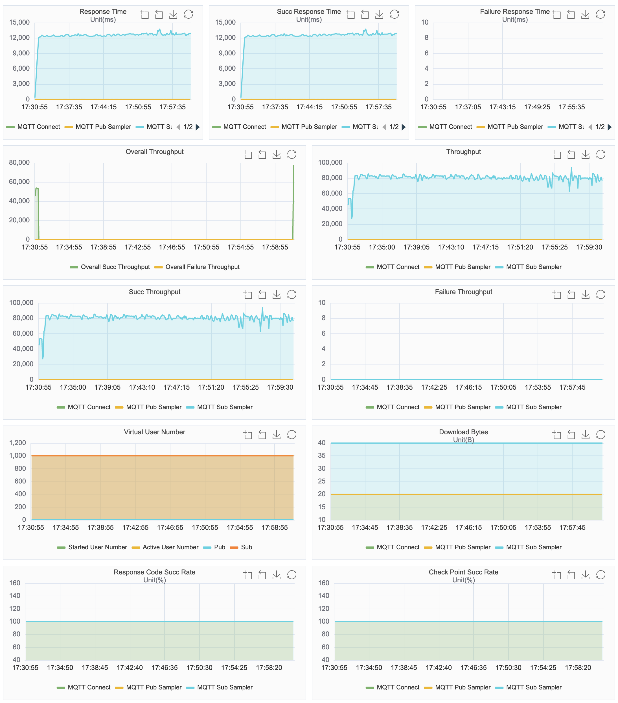

# Benchmark results of UC: singlenode-fanout-5-1000-5-250K

## Brokers

| Opensource **Broker** | **Version** |
| --------------------- | ----------- |
| EMQX 4                | 4.4.16      |
| EMQX 5                | 5.0.21      |
| Mosquitto             | 2.0.15      |
| NanoMQ                | 0.17.0      |

## Benchmark use case: singlenode-fanout-5-1000-5-250K

In this use case, 5 publishers publish messages to 5 topics, and 1,000 subscribers subscribe messages (each subscriber subscribs to all 5 topics). Specially, the use case is executed in the following way:

1. All publishers and subscribers connect to the TCP port of the broker.
2. Once the connection of a subscriber is established, the subscriber immediately subscribes to all 5 topics using QoS 1.
3. When all the connections are established, each publisher publishes message to a topic using QoS 1 with Retain as 0. Different publishers subscribe to different topics. The publish rate for each publisher is 50 messages per second. The payload size of each message is 16 bytes.
4. Keep the publish and subscribe for 30 minutes. The expected total publish rate is 250 messages per second, and the expected total subscribe rate is 250,000 messages per second.

MQTT protocol 3.1.1 is used for the use case, and other configured MQTT properties are:

<table>
	<tr>
		<td>TLS authentication enablement</td>
		<td>No</td>
	</tr>
	<tr>
		<td>Authentication enablement</td>
		<td>No</td>
	</tr>
	<tr>
		<td>Keep Alive (seconds)</td>
		<td>300</td>
	</tr>
	<tr>
		<td>Clean Session</td>
		<td>1</td>
	</tr>
</table>

## Testbed

The use case is executed on single node. XMeter (version 3.2.4) is used as the benchmark tool.

**HW Details**

- public cloud: AWS
- instance type: c5.4xlarge 16C32G
- OS: Ubuntu 22.04.1 amd64

## Metrics

|               | Actual msg rate | Average pub-to-sub latency (ms) | Max CPU user+system | Avg CPU user+system | Max memory used | Avg memory used |
| ------------- | --------------- | ------------------------------- | ------------------- | ------------------- | --------------- | --------------- |
| **EMQX 4**    | 250k            | 1.98                            | 83%                 | 79%                 | 517M            | 486M            |
| **EMQX 5**    | 250k            | 2.27                            | 81%                 | 79%                 | 540M            | 494M            |
| **Mosquitto** | 81k             | 12,445                          | 7%                  | 6%                  | 366M            | 351M            |
| **NanoMQ**    | 250k            | 14.07                           | 72%                 | 70%                 | 824M            | 685M            |

> in this scenario, Mosquitto couldn't reach to the designed message rate. The throughput has been fluctuating around 80,000/s.
>
> EMQX 4, EMQX 5 and NanoMQ kept the stable rate at 250,000/s during the test.

###  Appendix: result charts

#### EMQX 4

#### EMQX 5

#### Mosquitto

#### NanoMQ

