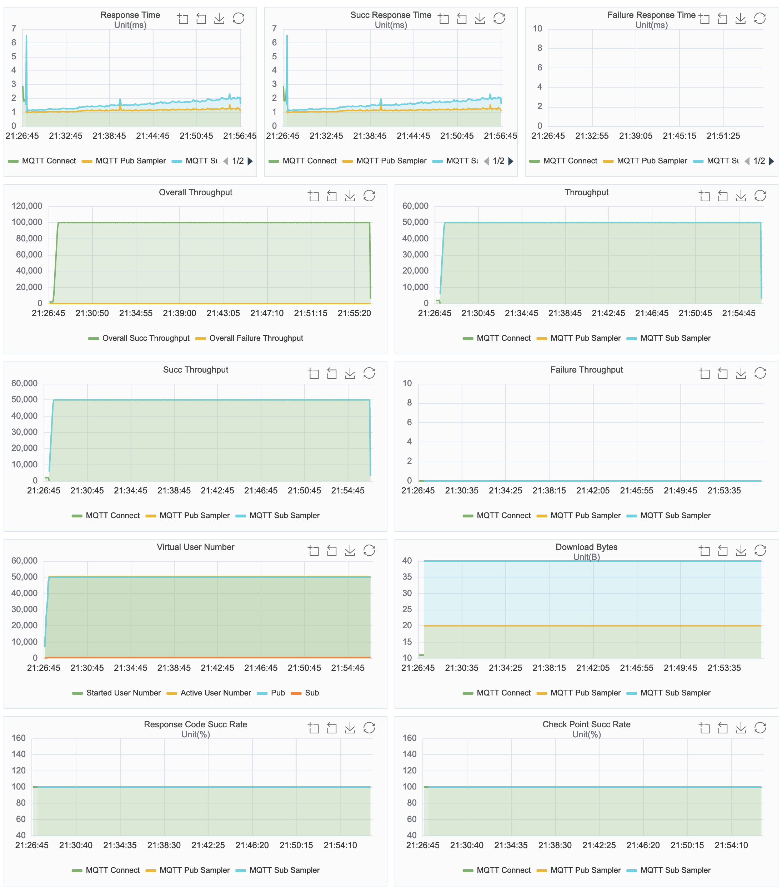
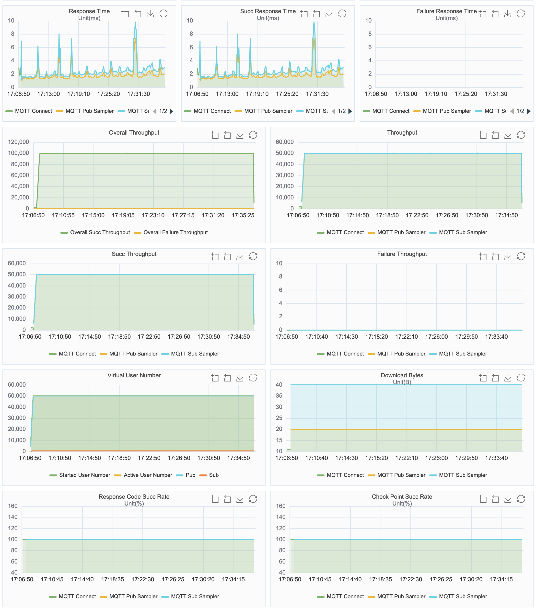
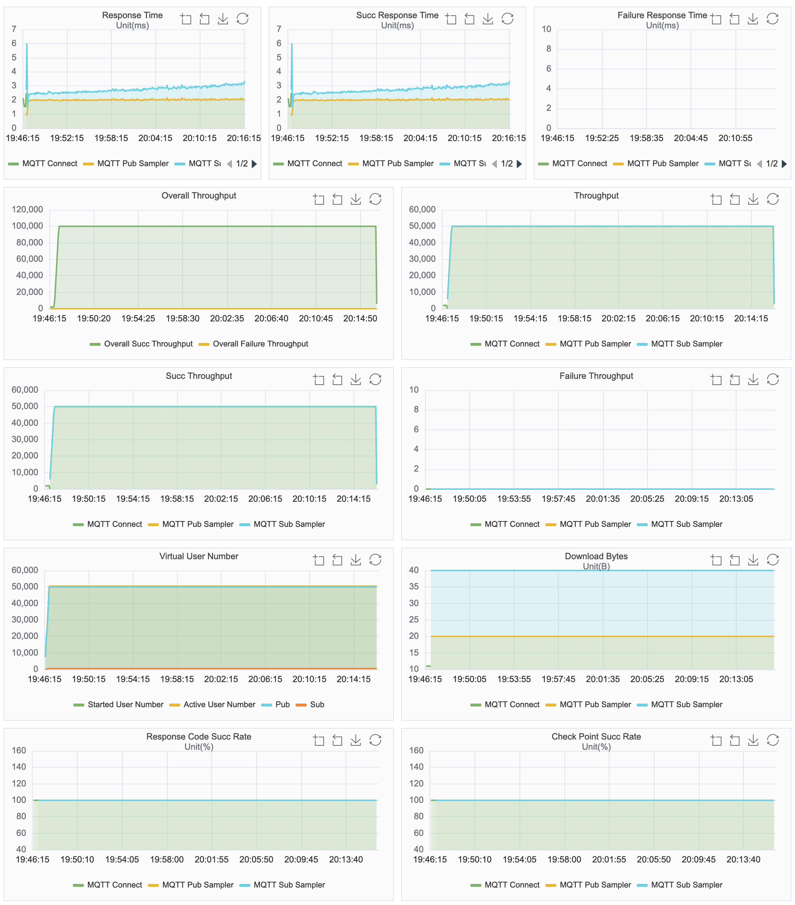

# Benchmark results of UC: singlenode-sharesub-50K-500-50K-50K

## Brokers

| Opensource **Broker** | **Version** |
| --------------------- | ----------- |
| EMQX 4                | 4.4.16      |
| EMQX 5                | 5.0.21      |
| Mosquitto             | 2.0.15      |
| NanoMQ                | 0.17.0      |

## Benchmark use case: singlenode-p2p-50K-50K-50K-50K

In this use case, 50,000 publishers publish messages to 50,000 topics, and 500 subscribers subscribe messages in shared subscription way. Specially, the use case is executed in the following way:

1. All publishers and subscribers connect to the TCP port of the broker.
2. Once the connection of a subscriber is established, the subscriber immediately subscribes to topics via shared subscription way using QoS 1. The shared subscription topic used is: $share/benchmark/test/#
3. When all the connections are established, each publisher publishes message to a topic using QoS 1 with Retain as 0. Different publishers subscribe to different topics. The topics are test/1, test/2, ..., test/50000. The publish rate for each publisher is 1 message per second. The payload size of each message is 16 bytes.
4. Keep the publish and subscribe for 30 minutes. The expected total publish rate is 50,000 messages per second, and the expected total subscribe rate is 50,000 messages per second.

MQTT protocol 5.0 is used for the use case as shared subscription feature is required, and other configured MQTT properties are:

<table>
	<tr>
		<td>TLS authentication enablement</td>
		<td>No</td>
	</tr>
	<tr>
		<td>Authentication enablement</td>
		<td>No</td>
	</tr>
	<tr>
		<td>Keep Alive (seconds)</td>
		<td>300</td>
	</tr>
	<tr>
		<td>Clean Session</td>
		<td>1</td>
	</tr>
</table>

## Testbed

The use case is executed on single node. XMeter (version 3.2.4) is used as the benchmark tool.

**HW Details**

- public cloud: AWS
- instance type: c5.4xlarge 16C32G
- OS: Ubuntu 22.04.1 amd64

## Metrics

|               | Actual msg rate  | Average pub-to-sub latency (ms) | Max CPU user+system | Avg CPU user+system | Max memory used | Avg memory used |
| ------------- | ---------------- | ------------------------------- | ------------------- | ------------------- | --------------- | --------------- |
| **EMQX 4**    | pub: 50ksub: 50k | 1.58                            | 94%                 | 93%                 | 8.27G           | 6.78G           |
| **EMQX 5**    | pub: 50ksub: 50k | 2.51                            | 94%                 | 93%                 | 6.6G            | 5.9G            |
| **Mosquitto** | pub: 50ksub: 40k | 12,476.34                       | 7%                  | 7%                  | 488M            | 466M            |
| **NanoMQ**    | pub: 50ksub: 50k | 2.76                            | 34%                 | 34%                 | 795M            | 783M            |

> in this scenario, the consumption rate of Mosquitto couldn't reach to the designed rate. It stabilized at 41,000/s.
>
> EMQX 4, EMQX 5 and NanoMQ kept the stable pub & sub rate at 50,000/s during the test.

###  Appendix: result charts

#### EMQX 4

#### EMQX 5

#### Mosquitto

#### NanoMQ

